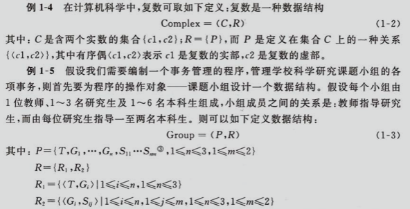
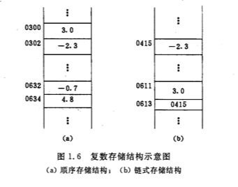
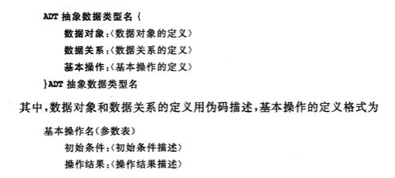
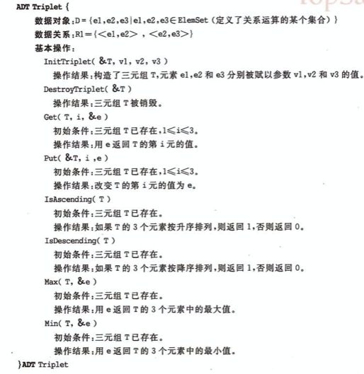
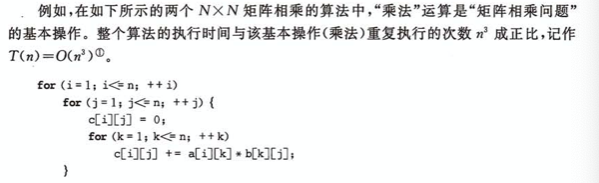
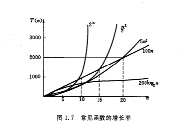

#  第一章 绪论

### 1.1 什么是数据结构

> 计算机处理的对象之间通常存在着一种最简单的线性关系,这类数学模型可称为线性数据结构(图书馆的书目检索系统)
> 树 也是一种数据结构
> 图也是数据结构


 `数据结构是一门研究非数值计算的程序设计问题中计算机的操作对象自己他们之间的关系和操作等的学科.`


### 1.2 基本概念和术语

> `数据`是对客观事物的符号表示,在计算机科学中是指所有能输入到计算器中并被计算机程序处理的符号的总称.

> `数据元素`是数据的基本单位,在计算机程序中通常最为一个整体进行考虑和处理. 
>
> 一个数据元素可由若干个`数据项`组成.
>
> `数据项`是数据不可分割的最小单位

> `数据对象`是性质相同的数据元素的集合,是数据的一个子集.

> `数据结构`是相互之间存在一种或多种特定关系的数据元素的集合.

>  数据元素都不是孤立存在的,而是在它们之间存在着魔种关系,这种数据元素相互之间的关系成为`结构`

基本结构分类

1. 集合
2. 线性结构
3. 树形结构
4. 图状结构或者网状结构

数据结构的形式定义-

>  数据结构是一个二元组
>
> Data_Sturcture = (D , S)
>
> 其中,D是数据元素的有限集,S是D上关系的有限集.

举例



结构中的关系描述的是数据元素之间的逻辑关系,因此又称为`逻辑结构`

数据结构在计算机中的表示(又称映像)称为数据的`物理结构`,又称`存储结构` 他包括数据元素的表示和关系的表示.

在计算机表示的信息的最小单位是二进制数的一位,叫做`位`

用一个由若干位组合起来形成的位串表示一个数据元素,通常称为`元素`或者`结点`.

当数据元素由若干数据项组成时,位串中对应于各个数据项的子位串称为`数据域`

因此,元素和结点可看成是数据元素在计算机中的映像.

> 个人理解
>
> 举例 整数集合 可以称为`元素和结点`
>
> 单个整数可以称为`数据域`,可以理解成`数据项`
>
> 数据元素等同于 元素和结点 ,等同于整数集合

数据元素之间的关系表示法:`顺序映射`和`非顺序映射` ,因此得到两种不同的存储结构:`顺序存储结构`和`链式存储结构`

> 顺序映像的特点是借助元素在存储器中的相对位置来表示数据元素之间的逻辑关系

> 非顺序映像的特点是借助指示元素存储地址的指针表示数据元素之间的逻辑关系



> 任何一个算法的设计取决于选定的数据(逻辑)结构,而算法的实现依赖于采用的存储结构

`数据类型`用来刻画(程序)操作对象的特性.

高级语言中,数据类型分为两种, `原子类型`,`结构类型`  

> 原子类型的值不可以分解  int  float
>
> 结构类型的值有若干成分按某种结构组成,可以分解

`抽象数据类型`(ADT)是指一个数学模型以及定义在该模型上的一组操作.

抽象数据类型的定义仅取决于它的一组逻辑特性,而与其在计算机内部如何表示和实现无关,即不论其内部结构如何变化,只要他的数学特性不变,都不影响其外部的使用(程序中的接口)

抽象数据类型按照值分类

1. `原子类型`,变量的值不可以分解
2. `固定聚合类型`,值由确定数目的成分按照魔兽结构组成. 举例,复数有两个实数依确定的次序关系构成
3. `可变聚合类型`,值的成分的数目不确定.

固定聚合类型和可变聚合类型 统称为结构类型

> 抽象数据类型可以用三元组表示
>
> (D,S,P)
>
> D是数据对象,S是D上的关系集,P是对D的基本操作集合

`p 简单理解就是函数`







### 1.3 抽象数据类型的表示和实现

参考工程代码

```
typedef int *Triplet;

Status InitTriplet(Triplet *T,int v1, int v2, int v3) {
    Triplet temp = (Triplet)malloc(3*sizeof(int));
    if (!temp) {
        exit(OVERFLOW);
    }
    temp[0]=v1;
    temp[1]=v2;
    temp[2]=v3;
    *T = temp;
    return OK;
}

Status destroyTriplet(Triplet T) {
    free(T);
    return OK;
}

Status Get(Triplet T,int i,int *e) {
    if (i<1 || i>3) {
        return ERROR;
    }
    *e = T[i-1];
    return OK;
}

Status Put(Triplet T, int i, int e) {
    if (i<1 || i>3) {
        return ERROR;
    }
    T[i-1] = e;
    return OK;
}

Status IsAccending(Triplet T) {
    return T[0]<=T[1] && T[1]<=T[2];
}

Status IsDescending(Triplet T) {
    return T[0]>=T[1] && T[1]>=T[2];
}

Status Max(Triplet T,int *e) {
    *e = (T[0]>=T[1])?((T[0]>=T[2])?T[0]:T[2]):(T[1]>T[2]?T[1]:T[2]);
    return OK;
}

Status Min(Triplet T,int *e) {
    *e = (T[0]<=T[1])?((T[0]<=T[2])?T[0]:T[2]):(T[1]<T[2]?T[1]:T[2]);
    return OK;
}

```


### 1.4 算法和算法分析

#### 1.4.1 算法

`算法` 是对特定问题求解步骤的一种描述,它是指令的有序序列,其中每个指令表示一个或多个操作

特性如下

1. 有穷性. 
2.  确定性
3.  可行性
4. 输入
5. 输出

#### 1.4.2 算法设计的要求

目标

1. 正确性
2. 可读性
3. 健壮性
4. `效率与存储量需求`

#### 1.4.3 算法与效率的度量

算法执行时间需要通过依据该算法编程的程序在计算机上的运行时所消耗的时间来度量

度量方法两种

1. 事后统计的方法
2.  时间分析估算的方法



一般情况下,算法中的基本操作重复执行的次数是问题规模n的某个函数f(n),算法的时间量度记作

$ T(n) = O(f(n)) $

他表示随着问题规模 $n$ 的增加,算法执行时间的增长率和 $f(n)$ 的增长率相同,称作算法的`渐进时间复杂度`,简称`时间复杂度`





平均时间复杂度

最坏情况下的时间复杂度

#### 1.4.4 算法的存储空间需求

空间复杂度作为算法所需存储空间的量度,记作 

$ S(n)=O(f(n))$

若额外空间相对于输入数据量来说是常数,则成此算法为原地工作


