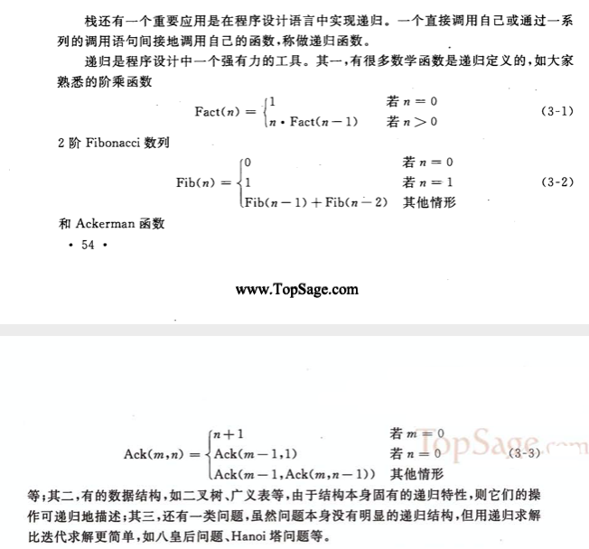

#  栈和队列


栈和队列的基本操作是线性表的操作的子集,他们的操作受限的线性表,可以成为`限定性的数据结构`

### 3.1 栈

#### 3.1.1 抽象数据类型栈的定义

> 栈是限定仅在表尾进行插入或者删除操作的线性表. 表尾称为`栈顶`,表头称为`栈底`

栈是后进先出的线性表


栈的抽象数据类型的定义:


#### 3.1.2 栈的表示和实现

`顺序栈` 是利用一组地址连续的存储单元依次存放自栈底到栈顶的数据元素,同时附设指针top 指示栈顶元素在顺序表中的位置


```c
typedef struct {
    int *base;
    int *top;
    int stacksize;
}SqStack;

Status InitStack(SqStack *S) {
    S->base = (int *)malloc(STACK_INIT_SIZE*sizeof(int));
    if (!S->base) {
        exit(OVERFLOW);
    }
    S->top = S->base;
    S->stacksize = STACK_INIT_SIZE;
    return OK;
}


Status GetTop(SqStack S,int *e) {
    if (S.top==S.base) {
        return ERROR;
    }
    *e = *(S.top-1);
    return OK;
}

Status Push(SqStack *S, int e) {
    if (S->top-S->base>=S->stacksize) {
        S->base = (int *)realloc(S->base, (S->stacksize+STACKINCREMENT)*sizeof(int));
        if (!S->base) {
            exit(OVERFLOW);
        }
        S->top = S->base+S->stacksize;
        S->stacksize += STACKINCREMENT;
    }
    S->top++;
    *S->top = e;
    return OK;
}

Status Pop(SqStack *S,int *e) {
    if (S->top == S->base) {
        return ERROR;
    }
    *e = *S->top--;
    return OK;
}

__attribute__((constructor))
static void beforeSqStackMain(void) {
    SqStack stack;
    InitStack(&stack);
    
    for (int i =0; i<10; i++) {
        Push(&stack, i);
    }
    int e;
    for (int i=0; i<10; i++) {
        Pop(&stack, &e);
        printf("%d\n",e);
    }
}
```


### 3.2 栈的应用举例

#### 3.2.1 数制转换


```c
Status StackEmpty(SqStack s) {
    if (s.top == s.base) {
        return 1;
    } else {
        return 0;
    }
}

__attribute__((constructor))
static void beforeConvertMain(void) {
    SqStack stack;
    InitStack(&stack);
        
    int N = (int)1348;
    printf("%d\n",N);

    while (N) {
        Push(&stack, N%8);
        N=N/8;
    }

    while (!StackEmpty(stack)) {
        int e;
        Pop(&stack,&e);
        printf("%d",e);
    }
    printf("\n");
}

```


#### 3.2.2 括号匹配检验


##### 3.2.3 行编辑程序


### 3.2 迷宫求解

#### 3.2.4 迷宫求解


```c
typedef struct {
    int x;
    int y;
}PosType;

typedef struct {
    int ord;
    PosType seat;
    int di;
}SElemType;

typedef struct {
    int x;
    int y;
    int qiang;
}MiGongLocType;


typedef struct {
    SElemType *base;
    SElemType *top;
    int stacksize;
}MazeStack;

Status MazeInitStack(MazeStack *S) {
    S->base = (SElemType *)malloc(STACK_INIT_SIZE*sizeof(SElemType));
    if (!S->base) {
        exit(OVERFLOW);
    }
    S->top = S->base;
    S->stacksize = STACK_INIT_SIZE;
    return OK;
}


Status MazeGetTop(MazeStack S,SElemType *e) {
    if (S.top==S.base) {
        return ERROR;
    }
    *e = *(S.top-1);
    return OK;
}

Status MazePush(MazeStack *S, SElemType e) {
    if (S->top-S->base>=S->stacksize) {
        S->base = (SElemType *)realloc(S->base, (S->stacksize+STACKINCREMENT)*sizeof(SElemType));
        if (!S->base) {
            exit(OVERFLOW);
        }
        S->top = S->base+S->stacksize;
        S->stacksize += STACKINCREMENT;
    }
    S->top++;
    SElemType *ele =S->top;
    ele->ord = e.ord;
    ele->seat = e.seat;
    ele->di = e.di;
    return OK;
}

Status MazePop(MazeStack *S,SElemType *e) {
    if (S->top == S->base) {
        return ERROR;
    }
    *e = *S->top--;
    return OK;
}

Status MazeStackEmpty(MazeStack s) {
    if (s.top == s.base) {
        return 1;
    } else {
        return 0;
    }
}

static MiGongLocType maze[10][10];
Status Pass(PosType curpos) {
    int j = curpos.y;
    int i = curpos.x;
    if (maze[i][j].qiang==0) {
        return 1;
    }
    return 0;
}

PosType NextPos(PosType cur,int ord) {
    int i = cur.x;
    int j = cur.y;
    if (ord == 1) {
        i++;
    }
    if (ord==2) {
        i--;
    }
    if (ord==3) {
        j++;
    }
    if (ord == 4) {
        j--;
    }
    PosType pos;
    pos.x = i;
    pos.y = j;
    return pos;
}

void FootPrint(PosType pos) {
    int j = pos.y;
    int i = pos.x;
    maze[i][j].qiang=2;
}

void MarkPrint(PosType pos) {
    int j = pos.y;
    int i = pos.x;
    maze[i][j].qiang=0;
}

Status MazePath(MiGongLocType maze[10][10],PosType start,PosType end) {
    for (int j = 0; j<10; j++) {
        for (int i=0; i<10; i++) {
            MiGongLocType loc = maze[i][j];
            printf("(%d %d %d)",loc.x,loc.y, loc.qiang);
        }
        printf("\n");
    }
    MazeStack stack;
    MazeInitStack(&stack);
    PosType curpos = start;
    int curstep = 1;
    do {
        if (Pass(curpos)) {
            FootPrint(curpos);
            SElemType e;
            e.ord = curstep;
            e.seat = curpos;
            e.di = 1;
            MazePush(&stack, e);
            if (curpos.x==end.x && curpos.y == end.y) {
                return OK;
            }
          
            curpos = NextPos(curpos, 1);
            curstep++;
            
        } else {
            if (!MazeStackEmpty(stack)) {
                SElemType e;
                MazePop(&stack, &e);
                while (e.di==4 && !MazeStackEmpty(stack)) {
                    MarkPrint(e.seat);
                    MazePop(&stack, &e);
                }
                if (e.di<4) {
                    e.di++;
                    MazePush(&stack, e);
                    curpos = NextPos(e.seat, e.di);
                }
            }
    
        }
    } while (!MazeStackEmpty(stack));
    return 0;
}

__attribute__((constructor))
static void beforeMiGongMain(void) {
    for (int i=0; i<10; i++) {
        for (int j=0; j<10; j++) {
            maze[i][j].x = i;
            maze[i][j].y = j;
            maze[i][j].qiang = 0;
            if (i==0 || i==9) {
                maze[i][j].qiang = 1;
            }
            if (j==0 || j==9) {
                maze[i][j].qiang = 1;
            }
            if (i==1 && j==8) {
                maze[i][j].qiang = 1;
            }
            if (i==2 &&(j==4 || j == 6 || j == 7)) {
                maze[i][j].qiang = 1;
            }
            if (i==3 && (j==1 || j == 2 || j==4 || j==7)) {
                maze[i][j].qiang = 1;
            }
            if (i==4 &&(j==4 || j==5 || j== 7)) {
                maze[i][j].qiang = 1;
            }
            if (i==5 && j==3) {
                maze[i][j].qiang = 1;
            }
            if (i==6 && (j==3 || j==6 || j==7 )) {
                maze[i][j].qiang = 1;
            }
            if (i==7 &&(j==1 || j== 2 || j==7)) {
                maze[i][j].qiang = 1;
            }
        }
    }
    PosType start;
    start.x = 1;
    start.y = 1;
    PosType end;
    end.x = 8;
    end.y = 8;
    MazePath(maze, start, end);
    printf("\n");
    for (int j = 0; j<10; j++) {
        for (int i=0; i<10; i++) {
            MiGongLocType loc = maze[i][j];
            printf("(%d %d %d)",loc.x,loc.y, loc.qiang);
        }
        printf("\n");
    }
}

```


### 算法3.3

#### 3.2.5 表达式求值


具体算法实现

```c

typedef struct {
    int *base;
    int *top;
    int stacksize;
}ExpressStack;

Status ExpressInitStack(ExpressStack *S) {
    S->base = (int *)malloc(STACK_INIT_SIZE*sizeof(int));
    if (!S->base) {
        exit(OVERFLOW);
    }
    S->top = S->base;
    S->stacksize = STACK_INIT_SIZE;
    return OK;
}


int ExpressGetTop(ExpressStack S) {
    if (S.top==S.base) {
        return ERROR;
    }
    return *(S.top);
}

Status ExpressPush(ExpressStack *S, int e) {
    if (S->top-S->base>=S->stacksize) {
        S->base = (int *)realloc(S->base, (S->stacksize+STACKINCREMENT)*sizeof(int));
        if (!S->base) {
            exit(OVERFLOW);
        }
        S->top = S->base+S->stacksize;
        S->stacksize += STACKINCREMENT;
    }
    S->top++;
    *S->top = e;
    return OK;
}

Status ExpressPop(ExpressStack *S,int *e) {
    if (S->top == S->base) {
        return ERROR;
    }
    *e = *S->top--;
    return OK;
}

static int OP[7]={'+','-','*','/','(',')','#'};

Status In(int c ,int op[7]) {
    for (int i =0; i<7; i++) {
        if (c == op[i]) {
            return 1;
        }
    }
    return 0;
}

int getChar(void) {
    static int step = 0;
    static int values[8]= {3,'*','(',7,'-',2,')','#'};
    int value = values[step];
    step++;
    return value;
}

int Precede(int a, int b) {
    if (a == '(' && b == ')') {
        return '=';
    }
    if (a == '#' && b == '#' ) {
        return '=';
    }

    if (b==')') {
        return '>';
    }
    if (b=='#') {
        return '>';
    }
    
    if (b == '(') {
        return '<';
    }
  
    if (a == '(') {
        return '<';
    }
    if (a == ')') {
        return '>';
    }
    if (a == '#') {
        return '<';
    }
    
    if (b == '+' || b == '-') {
        return '>';
    }
    
    if (b == '*' || a == '/') {
        if (a =='*' || a=='/') {
            return '>';
        } else {
            return '<';
        }
    }
   
    return '=';
}

int Operate(int a, int theta, int b) {
    switch (theta) {
        case '+':
            return a+b;
        case '-':
            return a-b;
        case '*':
            return a*b;
        case '/':
            return a/b;
    }
    return 0;
}

__attribute__((constructor))
static void beforeExpressMain(void) {
    ExpressStack OPTR;///运算符
    ExpressStack OPND;///数字
    ExpressInitStack(&OPTR);
    ExpressInitStack(&OPND);
    ExpressPush(&OPTR, '#');
    int c = getChar();
    // '#' 35
    // '*' 42
    // ')' 41
    // '(' 40
    // '-' 45
    while (c != '#' || ExpressGetTop(OPTR) != '#') {
        if (!In(c, OP)) {
            ExpressPush(&OPND, c);
            c = getChar();
        } else {
            switch (Precede(ExpressGetTop(OPTR), c)) {
                case '<': {
                    ExpressPush(&OPTR, c);
                    c = getChar();
                }
                    break;
                case '=': {
                    int x;
                    ExpressPop(&OPTR, &x);
                    c = getChar();
                }
                    break;
                case '>': {
                    int theta;
                    int a;
                    int b;
                    ExpressPop(&OPTR, &theta);
                    ExpressPop(&OPND, &b);
                    ExpressPop(&OPND, &a);
                    ExpressPush(&OPND, Operate(a,theta,b));
                    break;
                    
                }
              
            }
        }
    }
    printf("%d\n",ExpressGetTop(OPND));   
}
```

##### 算法 3.4


### 3.3 栈与递归的实现




思路


```c

void honoimove(int x,int n,int z) {
    printf("将编号为%d的圆盘从%d 移动到 %d 上\n",x,n,z);
}

void hanoi(int n,char x,char y,char z) {
    if (n==1) {
        honoimove(x,1,z);
    } else {
        hanoi(n-1, x, z, y);
        honoimove(x,n,z);
        hanoi(n-1, y, x, z);
    }
}


__attribute__((constructor))
static void beforeExpressMain(void) {
    hanoi(3,1,2,3);
}

```

##### 算法 3.5

### 3.4 队列

#### 3.4.1 抽象数据类型队列的定义

`队列`是一种`先进后出`的线性表.只允许在表的一端进行插入,在另一端进行删除.

允许插入的叫`队尾`,允许删除的一端称为`队头`.


抽象数据类型定义


除了栈和队列之外,还有一种限定性数据结构是双端队列


#### 3.4.2 链队列-队列的链式表示和实现

用`链表` 表示的队列称为`链队列`


```c
#include <stdio.h>
#include "UtilsHeader.h"

typedef struct QNode {
    int data;
    struct QNode *next;
}QNode, *QueuePtr;

typedef struct {
    QueuePtr front;
    QueuePtr rear;
}LinkQueue;

Status InitQueue(LinkQueue *Q) {
    Q->front =(QueuePtr)malloc(sizeof(QNode));
    if (!Q->front) {
        exit(OVERFLOW);
    }
    Q->rear = Q->front;
    Q->front->next = NULL;
    return OK;
}
//
Status DestroyQueue(LinkQueue *Q) {
    while (Q->front) {
        Q->rear = Q->front->next;
        free(Q->front);
        Q->front = Q->rear;
    }
    return OK;
}

Status EnQueue(LinkQueue *Q,int e) {
    QueuePtr p=(QueuePtr)malloc(sizeof(QNode));
    if (!p) {
        exit(OVERFLOW);
    }
    p->data  = e;
    p->next = NULL;
    Q->rear->next = p;
    Q->rear = p;
    return OK;
}
//
Status DeQueue(LinkQueue *Q,int *e) {
    if (Q->front == Q->rear) {
        return ERROR;
    }
    QueuePtr p = Q->front->next;
    *e = p->data;
    Q->front->next = p->next;
    if (Q->rear == p) {
        Q->rear = Q->front;
    }
    free(p);
    return OK;
}

__attribute__((constructor))
static void beforeQueueMain(void) {
    LinkQueue queue;
    InitQueue(&queue);
    for (int i=0; i<10; i++) {
        EnQueue(&queue, i);
    }
 
    QueuePtr start = queue.front->next;
    while (start) {
        printf("%d\t",start->data);
        start = start->next;
    }
    int e;
    for (int i=0; i<5; i++) {
        DeQueue(&queue, &e);
    }
    start = queue.front->next;
    printf("\n");
    while (start) {
        printf("%d\t",start->data);
        start = start->next;
    }
}
```


#### 3.4.3 循环队列--队列的顺序表示和实现

循环队列属于`顺序存储结构`


代码实现

```c
#include <stdio.h>
#include "UtilsHeader.h"

#define MAXQUSZIE 100
typedef struct {
    int *base;
    int front;
    int real;
}SqQueue;

Status SqInitQueue(SqQueue *Q) {
    Q->base = (int *)malloc(MAXQUSZIE*sizeof(int));
    if (!Q->base) {
        exit(OVERFLOW);
    }
    Q->front = 0;
    Q->real = Q->front;
    return OK;
}

Status SqInQueue(SqQueue *Q,int e) {
    if ((Q->real+1)%MAXQUSZIE==Q->front) {
        return ERROR;
    }
    Q->base[Q->real]=e;
    Q->real = (Q->real+1)%MAXQUSZIE;
    return OK;
}

Status SqDeQueue(SqQueue *Q,int *e) {
    if (Q->front == Q->real) {
        return ERROR;
    }
    *e = Q->base[Q->front];
    Q->front = (Q->front+1)%MAXQUSZIE;
    return OK;
}

Status SqQueueLength(SqQueue Q) {
    return (Q.real-Q.front+MAXQUSZIE)%MAXQUSZIE;
}

__attribute__((constructor))
static void beforeQueueMain(void) {
    SqQueue queue;
    SqInitQueue(&queue);
    for (int i=0; i<10; i++) {
        SqInQueue(&queue, i);
    }

    int start = queue.front;
    int end = queue.real;
    while (start!=end) {
        printf("%d\t",queue.base[start]);
        start = (start+1)%MAXQUSZIE;
    }
    int e;
    for (int i=0; i<5; i++) {
        SqDeQueue(&queue, &e);
    }
    start = queue.front;
    end = queue.real;
    printf("\n");
    while (start!=end) {
        printf("%d\t",queue.base[start]);
        start = (start+1)%MAXQUSZIE;
    }
    printf("\n%d",SqQueueLength(queue));
    printf("\n");
}

```


