#  第二章线性表

线性结构的特点. 线性结构的特点是:在数据元素的非空有限集中

1. 存在唯一的一个被称作`第一个的`数据元素
2. 存在唯一的一个被称作`最后一个`的数据元素
3.  除第一个之外,集合中的每个元素均只有一个前驱
4.  除最后一个之外,集合中的每个数据元素均只有一个后继


### 2.1 线性表的类型定义

`线性表`是最常用的最简单的一种数据结构.简言之,一个线性表是n个数据元素的有限序列

在稍复杂度线性表中,一个数据元素可以由`若干数据项` 组成.这种情况下,常把数据元素成为`记录`,含有大量记录的线性表又称`文件`

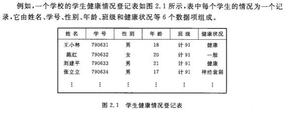

抽象数据类型线性表的定义如下

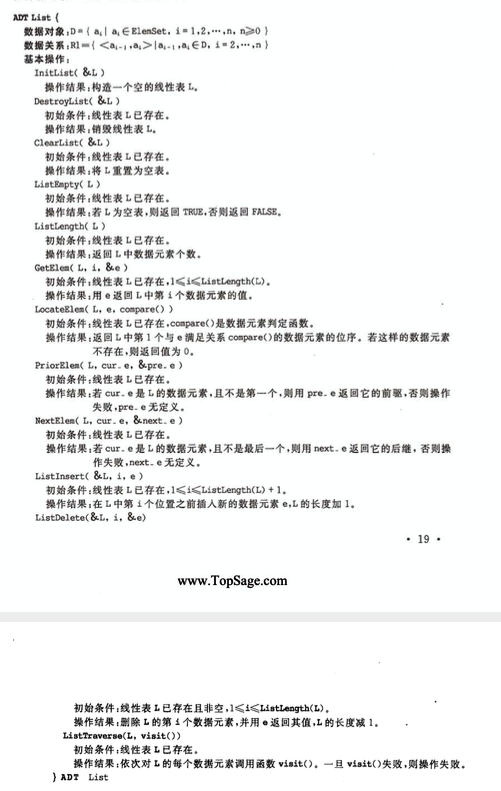

线性列表举例的部分c语言代码实现

```
//
//  LineList.c
//  DataStructure
//
//  Created by glodon on 2021/12/30.
//

#include <stdio.h>
#include "UtilsHeader.h"


struct DList {
    int maxLength;
    int length;
    int *data;
};

typedef struct DList *IntList;

Status InitList(IntList *list) {
    static int length = 1000;
    IntList temp = (IntList)malloc(sizeof(struct DList));
    if (!temp) {
        exit(OVERFLOW);
    }
    temp->maxLength = length;
    temp->length = 0;
    temp->data = (int *)malloc(length*sizeof(int));
    
    if (!temp->data) {
        exit(OVERFLOW);
    }
    *list = temp;
    return OK;
}

Status DestroyList(IntList *list){
    IntList temp = *list;
    free(temp->data);
    free(temp);
    return OK;
}

Status ClearList(IntList *list) {
    IntList temp = *list;
    temp->length = 0;
    return OK;
}

Status ListEmpty(IntList list) {
    return list->length == 0;
}

int ListLength(IntList list) {
    return list->length;
}

Status GetElem(IntList list, int i, int *e) {
    if (i>list->length && i<1) {
        return ERROR;
    }
    *e = list->data[i-1];
    return OK;
}

typedef int (* ListComare)(int, int);

int LocateElem(IntList list, int e, ListComare compare){
    int length = list->length;
    for (int i = 0; i<length; i++) {
        if (compare(e,list->data[i])) {
            return i+1;
        }
    }
    return 0;
}

Status ListInsert(IntList *list,int i, int e) {
    IntList temp = *list;
    int tempNext;
    for (int t = temp->length; t>=i; t--) {
        GetElem(temp, t, &tempNext);
        temp->data[t]=tempNext;
    }
    temp->data[i-1]=e;
    temp->length += 1;
    return OK;
}

int compareEqual(int a, int b) {
    return a == b;
}

void unionList(IntList *la,IntList lb) {
    int La_len = ListLength(*la);
    int lb_len = ListLength(lb);
    int e;
    for (int i=1; i<=lb_len; i++) {
        GetElem(lb, i, &e);
        if (!LocateElem(*la, e, compareEqual)) {
            ListInsert(la, ++La_len, e);
        }
    }
}

```

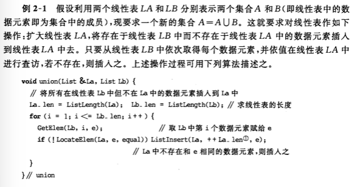

代码实现
```
__attribute__((constructor))
static void beforeMain(void)  {
    IntList list;
    InitList(&list);
    int m[5]={3,4,2,1,8};
    for (int i=0; i<5; i++) {
        ListInsert(&list, i+1, m[i]);
    }

    IntList listB;
    InitList(&listB);
    int n[5]={4,5,7,12,3};
    for (int i=0; i<5; i++) {
        ListInsert(&listB, i+1, n[i]);
    }
    
    unionList(&list,listB);
    
    int e;
    for (int i=0; i<list->length; i++) {
        GetElem(list, i+1, &e);
        printf("%d\n",e);
    }
    DestroyList(&list);
    DestroyList(&listB);
}
```

#### 2.1 算法

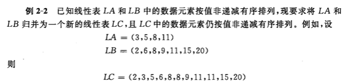

```
__attribute__((constructor))
static void beforeMergeMain(void) {
    IntList list;
    InitList(&list);
    int m[4]={3,5,8,11};
    for (int i=0; i<4; i++) {
        ListInsert(&list, i+1, m[i]);
    }

    IntList listB;
    InitList(&listB);
    int n[7]={2,6,8,9,11,15,20};
    for (int i=0; i<7; i++) {
        ListInsert(&listB, i+1, n[i]);
    }
    
    IntList listc;
    mergeList(list,listB,&listc);
    
    int e;
    for (int i=0; i<listc->length; i++) {
        GetElem(listc, i+1, &e);
        printf("%d\n",e);
    }
    
    DestroyList(&list);
    DestroyList(&listB);
    DestroyList(&listc);
}

```


#### 2.2 算法
上述算法的时间复杂度 是 $ O(ListLength(LA)+ListLength(LB)) $ 

### 2.2 线性表的顺序表示和实现

> 线性表的顺序表示指的是用一组地址连续的存储单元依次存储线性表的数据元素

元素表达式表示如下
    
$LOC(a_{i+1})=LOC(a_i)+l$

一般来说,线性表的第i个数据元素$a_i$的存储位置为

$ LOC(a_i)=LOC(a_1)+(i-1)*l$

这种存储结构的表成为顺序表

特定,为表中相邻元素$a_i$ he $a_{i+1}$ 赋以相邻的存储位置$LOC(a_i)$ 和 $LOC(a_{i+1})$

内存结构如下


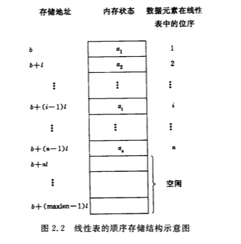

可以理解为高级语言中的数组

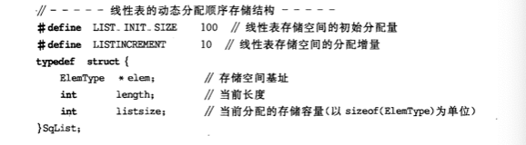

elem 是基地址

```c
#define LIST_INIT_SIZE 100
#define LISTINCREMENT 10

typedef struct {
    int *elem;
    int length;
    int listsize;
}Sqlist;


Status InitList_Sq(Sqlist *l) {
    l->elem = (int *)malloc(LIST_INIT_SIZE*sizeof(int));
    if (!l->elem) {
        exit(OVERFLOW);
    }
    l->length = 0;
    l->listsize = LIST_INIT_SIZE;
    return OK;
}
```


#### 2.3 算法

线性表的插入特性如下

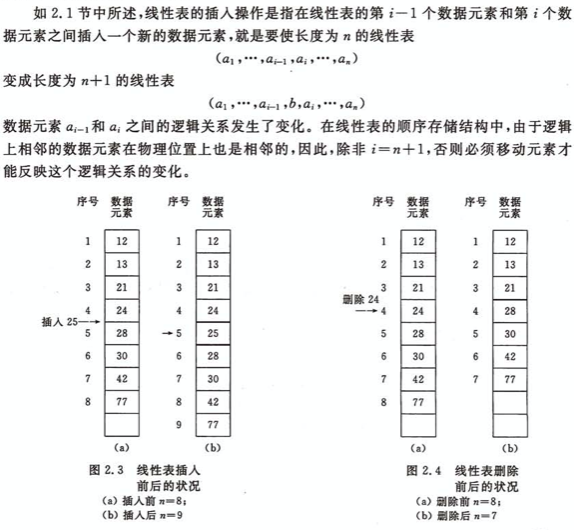


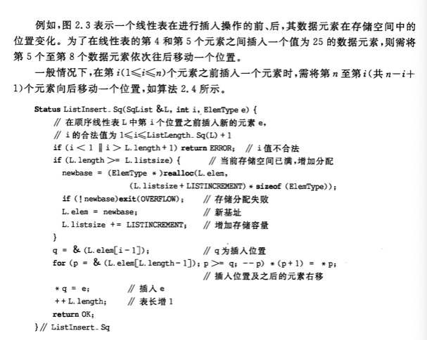

代码层次的实现如下

```c

Status ListInsert_Sq(Sqlist *l,int i,int e) {
    if (i<1 || i>l->length+1) {
        return ERROR;
    }
    
    if (l->length>=l->listsize) {
        int *newbase = (int*)realloc(l->elem, (l->listsize+LISTINCREMENT)*sizeof(int));
        if (!newbase) {
            exit(OVERFLOW);
        }
        l->elem = newbase;
        l->listsize+=LISTINCREMENT;
    }
    
    ///运用指针来计算的
    int *q = &(l->elem[i-1]);
    for (int *p = &(l->elem[l->length-1]) ; p>=q; --p) {
        *(p+1)=*p;
    }
    *q = e;
    l->length++;
    return OK;
}

```

其他代码补充

```c

#define LIST_INIT_SIZE 100
#define LISTINCREMENT 10

typedef struct {
    int *elem;
    int length;
    int listsize;
}Sqlist;


Status InitList_Sq(Sqlist *l) {
    l->elem = (int *)malloc(LIST_INIT_SIZE*sizeof(int));
    if (!l->elem) {
        exit(OVERFLOW);
    }
    l->length = 0;
    l->listsize = LIST_INIT_SIZE;
    return OK;
}

Status DestroyList_Sq(Sqlist *list){
    Sqlist temp = *list;
    free(temp.elem);
    return OK;
}

Status GetElem_sq(Sqlist list, int i, int *e) {
    if (i>list.length && i<1) {
        return ERROR;
    }
    *e = list.elem[i-1];
    return OK;
}

```

测试代码

```c
__attribute__((constructor))
static void beforeSqMain(void) {
    Sqlist list;
    InitList_Sq(&list);
   
    ListInsert_Sq(&list, 1, 1);
    ListInsert_Sq(&list, 1, 2);
    ListInsert_Sq(&list, 1, 3);
    ListInsert_Sq(&list, 1, 4);

    for (int i=0; i<list.length; i++) {
        int e;
        GetElem_sq(list,i+1,&e);
        printf("%d\n",e);
    }
    
    DestroyList_Sq(&list);
}
```

####  算法2.4

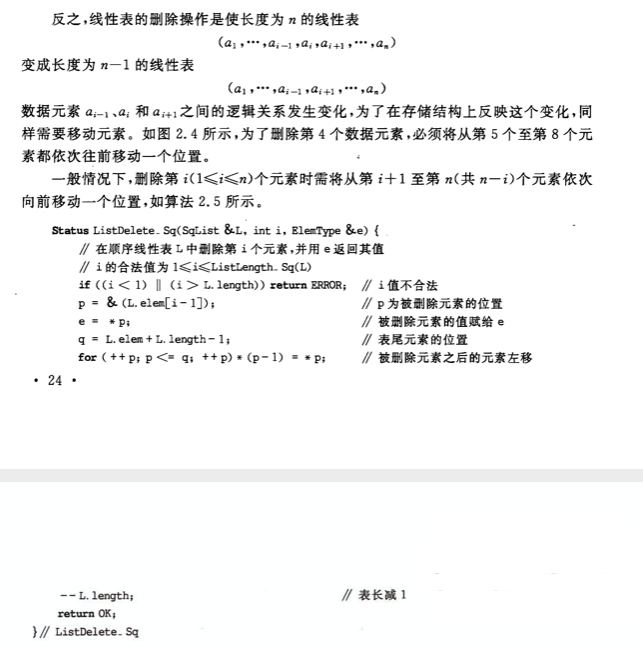


代码实现

```c
Status ListDelete_Sq(Sqlist *l ,int i,int *e) {
    if (i<1 || i>l->length+1) {
        return ERROR;
    }
    
    int *p =  &(l->elem[i-1]);
    *e = *p;
    int *q = l->elem+l->length-1;
    for (++p; p<=q; ++p) {
        *(p-1)=*p;
    }
    l->length--;
    return OK;
}
```

测试代码

```c
__attribute__((constructor))
static void beforedeSqMain(void) {
    Sqlist list;
    InitList_Sq(&list);
   
    ListInsert_Sq(&list, 1, 1);
    ListInsert_Sq(&list, 1, 2);
    ListInsert_Sq(&list, 1, 3);
    ListInsert_Sq(&list, 1, 4);
    int e;
    ListDelete_Sq(&list, 3, &e);
    printf("删除元素:%d\n",e);
    
    for (int i=0; i<list.length; i++) {
        int e;
        GetElem_sq(list,i+1,&e);
        printf("%d\n",e);
    }
    
    DestroyList_Sq(&list);
}

```


#### 算法 2.5 

顺序结构的线性表中某个位置上的插入或者删除一个数据元素时,其时间主要耗费在移动元素上.移动元素的个数取决于插入或者删除元素的位置

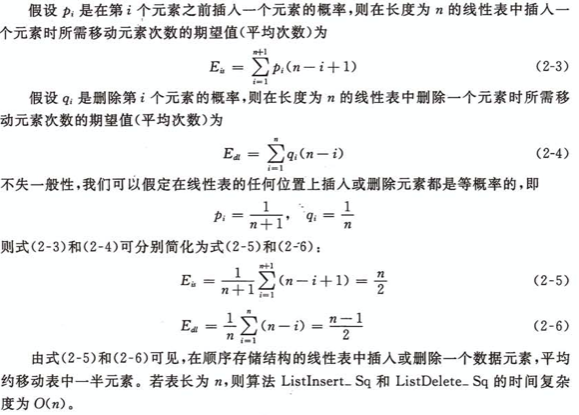


查询元素算法

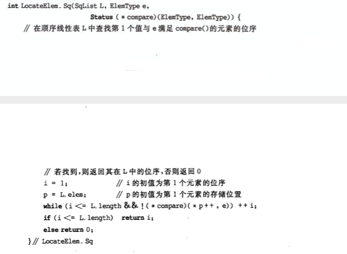

代码实现

```
typedef Status (* ListSqComare)(int, int);
int compareEqualSq(int a, int b) {
    return a == b;
}

int LocateElem_sq(Sqlist list, int e, ListSqComare compare){
    int length = list.length;
    for (int i = 0; i<length; i++) {
        if (compare(e,list.elem[i])) {
            return i+1;
        }
    }
    return 0;
}
```
测试代码
```c

__attribute__((constructor))
static void beforeQuerySqMain(void) {
    Sqlist list;
    InitList_Sq(&list);
   
    ListInsert_Sq(&list, 1, 1);
    ListInsert_Sq(&list, 1, 2);
    ListInsert_Sq(&list, 1, 3);
    ListInsert_Sq(&list, 1, 4);
    int index = LocateElem_sq(list, 3, compareEqualSq);
    printf("查找元素:%d\n",index);
    
    DestroyList_Sq(&list);
}
```


#### 算法2.6 

顺序表合并算法

```c
void mergeList_sq(Sqlist la, Sqlist lb, Sqlist *lc) {
    int *pa = la.elem;
    int *pb = lb.elem;
    int length = la.length+lb.length;
    lc->length = length;
    lc->listsize = length;
    int *pc = (int *)malloc(lc->listsize*sizeof(int));
    lc->elem = pc;
    if (!lc->elem) {
        exit(OVERFLOW);
    }
    int *palast = la.elem+la.length-1;
    int *pblast = lb.elem+lb.length-1;
    
    while (pa<=palast && pb<=pblast) {
        if (*pa<=*pb) {
            *pc++=*pa++;
        } else {
            *pc++=*pb++;
        }
    }
    while (pa<=palast) {
        *pc++=*pa++;
    }
    while (pb<=pblast) {
        *pc++=*pb++;
    }
}
```

测试代码

```c
__attribute__((constructor))
static void beforemergeSqMain(void) {
    Sqlist list;
    InitList_Sq(&list);
    ListInsert_Sq(&list, 1, 11);
    ListInsert_Sq(&list, 1, 9);
    ListInsert_Sq(&list, 1, 7);
    ListInsert_Sq(&list, 1, 4);
    
    Sqlist listb;
    InitList_Sq(&listb);
    ListInsert_Sq(&listb, 1, 13);
    ListInsert_Sq(&listb, 1, 6);
    ListInsert_Sq(&listb, 1, 3);
    ListInsert_Sq(&listb, 1, 1);
    
    Sqlist listc;
    mergeList_sq(list, listb, &listc);
    for (int i=0; i<listc.length; i++) {
        int e;
        GetElem_sq(listc,i+1,&e);
        printf("%d\n",e);
    }
    
    DestroyList_Sq(&list);
    DestroyList_Sq(&listb);
    DestroyList_Sq(&listc);
}
```

#### 算法 2.7

>  线性表表示的集合并进行集合的各种运算,应该对表中的元素进行排序.

### 2.3 线性表的链式表示和实现

> 顺序表的缺点,插入和删除操作需要大量的移动元素


`链式存储结构`不要求逻辑上相邻的元素在物理位置上相邻,因此没有顺序存储结构的弱点,但同时失去了顺序表可随机存取的优点.

#### 2.3.1 线性链表


线性表的链式存储结构的特点是用一组任意的存储单元存储线性表的数据元素(可以连续也可以不连续)

因此,为了表示每个数据元素$a_i$ 与其直接后继数据元素 $a_{i+1}$ 之间的逻辑关系,对数据元素 $a_i$ 来说,除了存储本身的信息之外,还需存储一个指示其直接后继的信息.  这两部分信息组成数据元素 $a_i$ 的存储影像,成为`结点`. 包括两个域,其中存储数据元素信息的域称为`数据域`,存储后继存储位置的域称为`指针域`.

n个结点($a_i\leq i \leq n)$)的存储影像 链接成一个链表,即为线性表

$(a_1,a_2,...,a_n)$ 

的链式存储结构

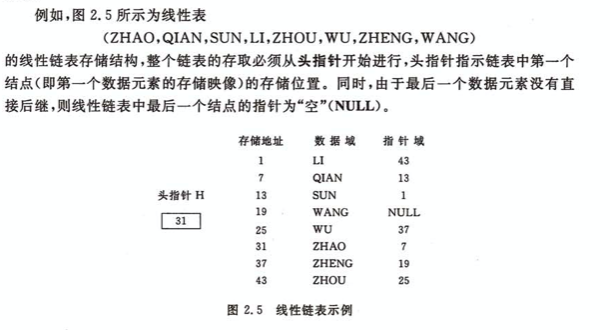


这种结构为非顺序映像或链式映像

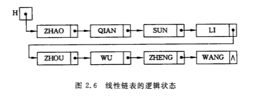


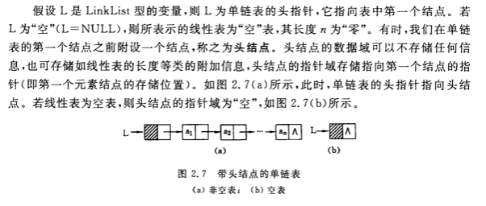

```
typedef struct LNode{
    int *data;
    struct LNode *next;
}LNode, *LinkList;

Status Get_Elem_L(LinkList L,int i, int *e) {
    LinkList p=L->next;
    int j = 1;
    while (p && j<i) {
        p=p->next;
        j++;
    }
    if (!p||j>i) {
        return ERROR;
    }
    e = p->data;
    return OK;
}

```

##### 算法 2.8
